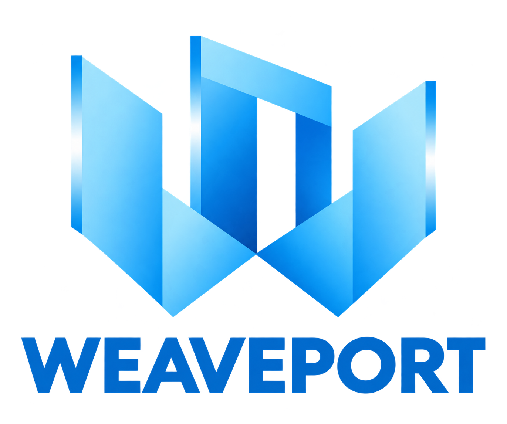

<p align="center">
  
</p>

# Turn your .NET app into a platform.

**Add C#, Python and TypeScript plugins to your product.** WeavePort runs them, connects them to approved application services and manages their workers. Your application owns the data, permissions and business rules.

Build document readers, evaluation strategies or customer-specific scheduling rules as plugins. Give each one the access it needs and call it through the same .NET client contract.

[Get started](website/getting-started.md) · [Why WeavePort?](website/introduction.md) · [Write a plugin](docs/plugin-sdk.md) · [NuGet packages](website/packages.md)

**MIT · .NET 10 · Windows, Linux & macOS · Public release 0.2.0**

Built for .NET. Designed for Windows, Linux and macOS. The supported cross-platform execution path uses standard input/output (stdio) for owner-controlled plugins. Current release validation covers macOS arm64; Windows and Linux release validation is pending. See the [platform support and validation matrix](docs/platform-qualification.md). The pre-1.0 API is evolving; native processes are not a sandbox for hostile code.

## Build with your AI assistant

Point your assistant at [llms.txt](https://weaveport.dev/llms.txt), or load the [full reference](https://weaveport.dev/llms-full.txt). [Connect GitHub MCP](docs/ai-documentation.md#connect-the-official-github-mcp-server) to retrieve matching source, examples and API contracts directly from the repository.

## Why WeavePort?

- **Let each extension use the right language.** Write plugins in C#, Python or TypeScript and invoke them through one .NET client interface. Function names and JSON schemas remain your application's contract.
- **Keep data access in your application.** Give plugins explicit callback capabilities. Your host supplies the authenticated context and checks access to individual objects.
- **Share the runtime work.** One host manages worker startup, deadlines, admission and cleanup. The coordinator template shares those budgets across application operations.
- **Keep your product's architecture.** Your application chooses its database, workflows and recovery policy. WeavePort arrives as NuGet libraries you embed in your backend.

## See it working

Decision Room runs C# and Python strategies against the same proposals. The application grants knowledge access and saves the resulting evaluations. With the default configuration, **B — Automate support** wins with a score of **11**.

This Bash walkthrough is validated on macOS arm64. Linux can use the same source workflow, with release validation pending; native Windows needs equivalent build steps and Windows interpreter paths (the script assumes a Unix virtual environment). Install the .NET SDK in [global.json](global.json) and Python 3.11+ with `venv` and `pip`, then run:

```sh
git clone https://github.com/yesbert/WeavePort.git
cd WeavePort
./scripts/decision-room.sh --build
```

The first build restores packages and creates a private Python environment. The example needs no external database, account or Docker service. [Follow the walkthrough](website/getting-started.md) to change a strategy, resume a journal and run verification.

## A plugin is an ordinary function

This minimal Python provider exposes an `echo` function to an authorized host binding:

```python
from weaveport_sdk import PluginApplication

app = PluginApplication()

@app.function("echo")
async def echo(value, context):
    return value

app.run()
```

The same SDK supports asynchronous result streams and granted host callbacks. Python and TypeScript SDKs are built from the repository; they are not yet published to PyPI or npm. See the complete [Python](examples/sdk/python/plugin.py), [C#](examples/sdk/csharp/Program.cs) and [TypeScript](examples/sdk/typescript/plugin.ts) examples and the [authoring guide](docs/plugin-sdk.md).

## Add WeavePort to your application

In the .NET application project:

```sh
dotnet add package WeavePort.Hosting --version 0.2.0
dotnet add package WeavePort.Sdk.Client --version 0.2.0
```

For a C# plugin, reference `WeavePort.Sdk` at the same version. `WeavePort.Abstractions` contains the shared contracts. These are the four public packages; optional Gateway, Composition and Testing are outside this release.

[Compose one host](docs/embedded-coordinator.md), [select approved plugin artifacts](docs/installed-plugins.md) and [check exact compatibility](docs/package-compatibility.md). Package installation supplies the libraries; the runnable examples show the complete integration.

## Start from a real use case

| You want to… | Start here | What you will learn |
|---|---|---|
| Let customers choose an evaluation strategy | [Decision Room](samples/DecisionRoom/README.md) | C#/Python strategies, scoped knowledge and replay |
| Add readers for different document sources | [Document Workshop](samples/DocumentWorkshop/README.md) | Interchangeable readers, bounded access and staged commits |
| Make scheduling rules replaceable | [Appointment Desk](samples/AppointmentDesk/README.md) | Shared admission, idempotent actions and recovery |

Each example includes a `--build --verify` runner under `scripts/`. Its domain contracts and storage belong to the application, so you can study the integration independently of a particular database or sibling framework.

## Choose with the full picture

WeavePort is a fit when you control the plugin code and want an extensible .NET backend. Native workers have the application's OS-user rights. If you need to execute arbitrary untrusted uploads, that requires a stronger, separately qualified execution boundary.

Worker memory is temporary; applications own durable state and the handling of uncertain external effects. Windows, Linux and macOS are supported targets for trusted stdio execution; platform-specific release validation and remote production qualification are separate. See the [platform matrix](docs/platform-qualification.md). Read [current status](docs/status.md), [security boundaries](docs/security-architecture.md) and [recovery guidance](docs/native-operations.md) before deployment.

## Documentation, help and contributions

- [Introduction](website/introduction.md), [first example](website/getting-started.md) and [FAQ](website/faq.md).
- [Architecture](docs/architecture.md), [worker lifecycle](docs/worker-lifecycle.md) and [diagnostics](docs/runtime-diagnostics.md).
- [AI documentation](docs/ai-documentation.md) and the [llms.txt index](llms.txt).
- [Report an issue or suggest an improvement](https://github.com/yesbert/WeavePort/issues).
- [Contribute](CONTRIBUTING.md), [run focused checks](tests/README.md) or [build the documentation website](website/README.md).

Maintained by [Norbert Rosenwinkel](https://github.com/yesbert). Released under the [MIT license](LICENSE).
